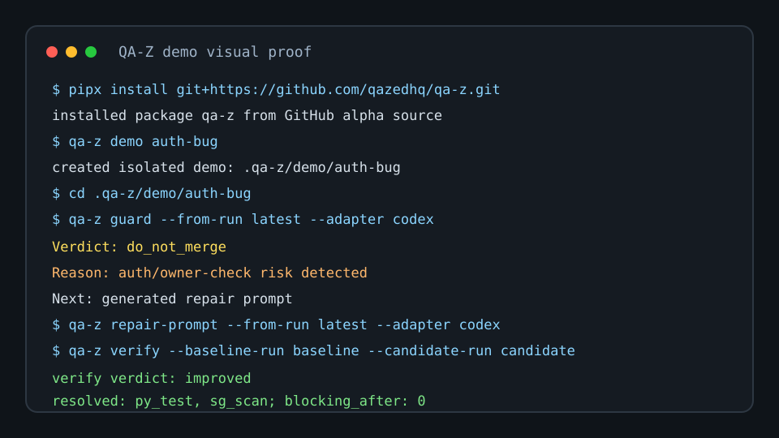

# QA-Z 🛡️

> Make AI coding safe to merge.

[](https://github.com/qazedhq/qa-z/actions/workflows/ci.yml)


[](https://github.com/qazedhq/qa-z/releases/tag/v0.9.9-alpha)

AI agents write code fast. QA-Z tells you whether their changes are safe to merge by turning agent diffs into deterministic merge evidence: contracts, fast/deep checks, repair prompts, and verification reports.

Run the auth-bug demo from the GitHub source install to watch QA-Z catch a risky agent auth change before merge:



This is a deterministic terminal cast proof, not a GIF. The short visual follows the same `do_not_merge` -> repair prompt -> `qa-z verify` -> `improved` story as the first-screen excerpt. The checked-in sources are [docs/assets/qa-z-demo.cast](docs/assets/qa-z-demo.cast), [docs/assets/qa-z-demo.svg](docs/assets/qa-z-demo.svg), and the fuller [agent-auth-bug asciinema cast](docs/assets/qa-z-agent-auth-bug.cast).

```bash
pipx install git+https://github.com/qazedhq/qa-z.git
qa-z demo auth-bug
```
```text
Verdict: do_not_merge
Reason: auth/owner-check risk detected
Next: use the generated repair prompt, then run qa-z verify
```

## Quickstart
```bash
qa-z demo auth-bug
cd .qa-z/demo/auth-bug
qa-z guard --from-run latest --adapter codex
qa-z repair-prompt --from-run latest --adapter codex
cp app/auth.fixed.py app/auth.py && qa-z verify --from-run latest --config qa-z.demo.yaml
```

Automation can use `qa-z demo auth-bug --json` for demo root, verdict, repair prompt, fixed-file copy, and follow-up commands. The full local loop is documented in [Repair -> verify workflow](docs/repair-verify-workflow.md).

For your own repository:
```bash
qa-z init --profile python --with-agent-templates
qa-z doctor && qa-z scorecard
qa-z guard --adapter codex --deep auto --fail-on-risk
qa-z repair-prompt --from-run latest --adapter codex
qa-z verify --from-run latest
```

If the console script is not on PATH, use `python -m qa_z` as a fallback.

## GitHub Alpha Install

```bash
pipx install git+https://github.com/qazedhq/qa-z.git
uv tool install git+https://github.com/qazedhq/qa-z.git
python -m pip install -e .[dev]
```

Install Semgrep when running deep checks locally:

```bash
python -m pip install semgrep
```

## Why QA-Z?

AI-generated code often arrives with a confident summary and scattered evidence. QA-Z answers the merge question directly; see [Comparison](docs/comparison.md) for where it fits around Codex, Claude Code, Cursor, aider, OpenHands, Goose, Semgrep, CI tools, and human review.

> Is this AI-generated change safe to merge? If not, what should the agent fix next? After repair, did it actually improve?

## Before / After

Before QA-Z:

- manual context reconstruction
- disconnected test failures
- missed security risk
- unclear agent repair scope

After QA-Z:

- QA contract
- fast and deep evidence
- repair prompt
- verified repair
- reviewable merge verdict

## What You Get

- QA contracts
- Fast checks
- Semgrep-backed deep checks
- Repair prompts for Codex, Claude Code, and humans
- Post-repair verification
- GitHub summaries and SARIF
- Agent safety skills for Codex, Claude Code, Cursor, and GitHub Copilot

## qa-z guard

Run the one-command merge-safety path:

```bash
qa-z guard --adapter codex --deep auto --fail-on-risk
```

The guard writes:

- `.qa-z/runs/latest/guard/verdict.json`
- `.qa-z/runs/latest/guard/verdict.md`
- `.qa-z/runs/latest/review/review.md`
- `.qa-z/runs/latest/repair/codex.md` when repair is needed

Verdicts are `merge_ok`, `do_not_merge`, `needs_review`, or `error`.

Long-form demo loop:

```bash
qa-z fast --output-dir .qa-z/runs/baseline
qa-z deep --from-run .qa-z/runs/baseline
qa-z repair-prompt --from-run .qa-z/runs/baseline --adapter codex
```

After applying the included repair, `qa-z verify --from-run .qa-z/runs/baseline` should report verdict `improved` with no regressions.

## Agent Skill Pack

Install copy-paste safety instructions:

```bash
qa-z skill install all
```

Targets: Codex `AGENTS.md`, Claude `CLAUDE.md`, Cursor `.cursor/rules/qa-z.mdc`, and GitHub Copilot `.github/copilot-instructions.md`.

The reusable skill lives at [skills/qa-z-merge-safety/SKILL.md](skills/qa-z-merge-safety/SKILL.md).

## GitHub Action

After the CLI demo, the next step is a copy-paste PR gate with read-only permissions and Job Summary/artifact evidence.

```yaml
name: QA-Z

on:
  pull_request:

jobs:
  qa-z:
    runs-on: ubuntu-latest
    permissions:
      contents: read
      actions: read
    steps:
      - uses: actions/checkout@v6
        with:
          persist-credentials: false
      - uses: qazedhq/qa-z/.github/actions/guard@main
        with:
          profile: python
          deep: auto
          adapter: codex
```

See [docs/github-action.md](docs/github-action.md) for the 5-minute path: minimal PR gate, PR summary/artifacts, SARIF upload opt-in, and troubleshooting FAQ, including input validation diagnostics.
Add `security-events: write` only when SARIF upload is explicitly enabled; PR/bot comments stay opt-in.

## Agent QA Playbook

- [Agent QA Playbook](docs/agent-qa-playbook.md)
- [AI Code Merge Checklist](docs/ai-code-merge-checklist.md)
- [Bad AI Code Examples](docs/bad-ai-code-examples.md)
- [Use with Codex](docs/use-with-codex.md)
- [Codex Repair Recipes](docs/codex-repair-recipes.md)
- [Claude Code Repair Recipes](docs/claude-code-repair-recipes.md)
- [Cursor Safety Rules](docs/cursor-safety-rules.md)
- [Semgrep For AI-Generated Code](docs/semgrep-for-ai-generated-code.md)
- [Use with GitHub Copilot](docs/use-with-github-copilot.md)
- [Launch kit](docs/launch/launch-kit.md)
- [Product direction](docs/product/PRODUCT_DIRECTION.md)
- [V8 handoff](docs/product/V8_HANDOFF.md)
- [Product decisions](docs/product/PRODUCT_DECISIONS.md)
- [Benchmarking](docs/benchmarking.md)

## Advanced Commands

These commands are local planning and evidence surfaces. When `self-inspect` or
`select-next` sees strict worktree commit-plan evidence, dirty-worktree tasks can
point at scoped patch-add commands from `.qa-z/tmp/worktree-commit-plan.json`.
`qa-z autonomy --loops 1 --json` writes selected-task action hints, validation,
and context paths; `qa-z autonomy status` renders the same actions as
line-broken operator output. `selected-task patch-add commands` appear as their
own bullets, and dirty-worktree actions use a fresh backlog check
(`python -m qa_z backlog --refresh --json`) before stale action packets.

- `qa-z self-inspect`
- `qa-z select-next`
- `qa-z backlog`
- `qa-z autonomy`
- `qa-z executor-bridge`
- `qa-z executor-result`

## What QA-Z Is Not

QA-Z is not an autonomous code editor, an LLM judge, a replacement for tests,
Semgrep, or human review, a package-registry publish yet, or a tool that
commits, pushes, opens PRs, or comments on GitHub by itself.

## Roadmap

See [docs/roadmap.md](docs/roadmap.md).

- `v0.9.9-alpha`: repo hygiene, guard, demo, skill pack, GitHub Action, install docs
- `v0.10.0-beta`: release polish, hosted-demo path, and package-publish readiness
- `v0.11.0`: deeper verification UX, benchmarks, integrations

## Contributing

Read [CONTRIBUTING.md](CONTRIBUTING.md), [SUPPORT.md](SUPPORT.md), [SECURITY.md](SECURITY.md), and [CODE_OF_CONDUCT.md](CODE_OF_CONDUCT.md), then run:

```bash
python -m pip install -e .[dev]
python -m pytest
python -m qa_z --help
```

Keep deterministic gates ahead of claims. Do not claim PyPI or marketplace availability until those releases exist.

## License

Apache-2.0
